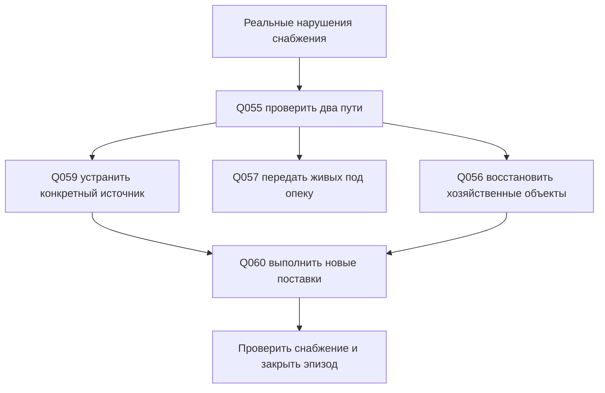

# Сюжетные цепочки и кризис снабжения

**Предложение:** несколько коротких работ дают знания и меняют мир; крупная история связывает их, сохраняя разные подтверждённые исходы. Граф ниже — направление возможностей, не принудительный маршрут и не готовый сценарный runtime.

Уникальные цепочки относятся к общему эпизоду, а не к каждому аккаунту.
Поздний игрок узнаёт доступные факты из разговора/отчёта и может взять оставшуюся
самостоятельную работу; личное прохождение предшествующего задания не требуется.
История не сбрасывается ради нового участника. [Профиль общего мира](shared-world.md).

## Чужой хлеб

[Q001 зерно](quests/q-001.md) может обнаружить расхождение → [Q031 недовес](quests/q-031.md) различает меру и потерю → [Q032 расписка](quests/q-032.md) проверяет законность передачи. Реальная потеря открывает [Q017 поиск партии](quests/q-017.md); подтверждённый запас/замена — [Q053 восстановление пищи](quests/q-053.md). Если появился реальный долг, [Q054 расчёт](quests/q-054.md) завершает имущественный спор.

Развилки: ошибка меры прекращает ветку обвинения; законная выдача сохраняет права нового владельца; доказанная кража требует возврата/законной ответственности. Купить замену можно, но это не оправдывает вора. Узкое сообщение сохраняет локальный круг осведомлённых; сообщение затронутым сторонам меняет их решения только после получения фактов. Убийство зверя у мельницы не устанавливает виновного в этой цепи.

## Дорога и цена восстановления

[Q003 крепёж](quests/q-003.md) + [Q021 древесина](quests/q-021.md) дают входы для [Q052 первый восстановленный переход](quests/q-052.md). Доступ к работе обеспечивается подготовкой и испытанием [Q047 обхода](quests/q-047.md); исходная угроза при этом остаётся и может быть устранена отдельной охотой. [Q024 ремонт](quests/q-024.md) — дальнейшее обслуживание нового повреждения, а не ещё одна плата за Q052.

Развилки: восстановить прежний переход или подготовить разрешённый другой; сохранить промежуточный проход для жителей либо завершить ремонт быстрее с временным закрытием. Выбор влияет на фактический будущий доступ и расходы. Если материалов нет, сначала отдельная доставка; составленные планы не открывают мост.

## Лес не очищается одной победой

[Q012 стая](quests/q-012.md) устраняет одну реальную опасность; [Q035 отходы](quests/q-035.md) проверяет её хозяйственную причину; [Q023 травы](quests/q-023.md) задаёт способ заготовки; [Q058 рабочий выход](quests/q-058.md) завершает историю подтверждённой безопасной работой.

Устранённая стая без изменения отходов не гарантирует спокойного будущего. Удалённые отходы не убивают существующих зверей. Малая безопасная зона приносит меньший фактический запас; работа по расширению дороже и опаснее. Полный лес не становится безопасным после одной галочки.

## Человек и право вернуть его

[Q036 письмо](quests/q-036.md) или реальные следы дают повод для [Q049 поиск пропавшего](quests/q-049.md). Пленный требует освобождения, свободный человек вправе отказаться от возврата; договор прямо оплачивает подтверждение свободного решения. [Q043 спасение у руины](quests/q-043.md), [Q046 человек и вещи](quests/q-046.md), [Q050 два получателя ухода](quests/q-050.md) проверяют физическую опеку.

Выбор приоритета меняет время доступной помощи и имущество под опекой, не назначает смерть из текста. Нельзя превращать работника в пленного только потому, что он не хочет вернуться. Победа компании не заменяет передачу живого человека.

## Один предлагаемый кризис

**Тип для обсуждения: срыв снабжения из-за реальной угрозы путям.** Это авторская кандидатура единственного кризиса первой песочницы, не уже утверждённый тип, не новый культ/война/магия. Названные фракции и сверхъестественная история не добавлены.

### Предлагаемые стадии

1. **Накопление:** доступны подтверждённые нарушения конкретных поставок, запас ниже объявленного минимума два последовательных расчётных периода. Предлагаемый период — 1 Campaign Day; нельзя объявить нападение из одного пустого кошелька.
2. **Активный эпизод:** существует действительный источник опасности и две нарушенные снабженческие связи. [Q055](quests/q-055.md) даёт доступные сведения, [Q059](quests/q-059.md) решает конкретную угрозу. Уже принятые маршруты/договоры не переписываются без принятой причинной политики.
3. **Последствия:** реальные повреждения/вытеснение людей создают [Q056](quests/q-056.md) и [Q057](quests/q-057.md). Без повреждения не появляется ремонт; без действительных пострадавших — эвакуация.
4. **Восстановление:** [Q060](quests/q-060.md) закрывает конечные поставки, работающие объекты дают фактическое производство. Смерти, долги и потери сохраняются.
5. **Закрытие:** источник блокировки устранён, оба требуемых пути реально доступны, названные люди переданы или их действительный иной исход зафиксирован, хозяйственные запасы выше принятого минимума два периода. Подтверждённые потери не скрываются словом «победа».

Повтор — только новый причинный эпизод после минимум 7 Campaign Days устойчивого снабжения; предлагаемые 7 дней = 42 реальных часа, не семь световых циклов. Сам таймер не создаёт новые вражеские группы. Если регион остаётся спокойным, кризис не обязан повториться. Территориальное завоевание и постоянное уничтожение поселений не добавляются.

### Роли компаний

Одна компания ищет настоящую цель, другая отдельно доставляет материалы, третья отдельно спасает людей. Каждая имеет свой подлинный оплачиваемый результат, средства и договор; один трофей не делится на несколько полных наград. Один owner и не более одного opt-in helper внутри обычного договора сохраняются. Лимиты существующего боя не увеличиваются ради массового финала.

При отсутствии активных игроков нет скрытого полного сброса мира или автоматического F1. Уже принятые защитные/offline правила продолжаются. Порог/скорость кризиса, достаточное время реакции и доступность заданий для 10–20 компаний — ещё не измерены; их надо проверить на одном эпизоде, а не вводить сразу много типов кризиса.

[Экономика и бюджет](economy.md) · [Правила повторения](quest-rules.md) · [Каталог](catalogue.md) · [Источники](sources.md).
