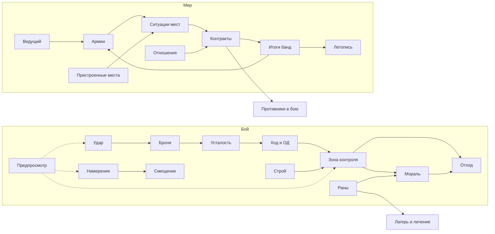

# Механики Warwrit

Одна страница — одна механика. На каждой: статус, суть, правило или
предложение, что видит игрок, связи с другими механиками, ориентир и
ошибка, которой избегаем, открытые вопросы. Почему выбраны эти ориентиры —
[Ориентиры и ошибки](../benchmarks.md); короткая выжимка для агентов —
[DESIGN_COMPASS](../../engineering/DESIGN_COMPASS.md).

## Статусы

| Статус               | Значение                                                                         |
| -------------------- | -------------------------------------------------------------------------------- |
| **В ядре**           | Есть в прототипе боя `m0-prototype-v1`; числа помечены `provisional`             |
| **Решено**           | Решение владельца; реализации может ещё не быть                                  |
| **Первый приоритет** | Владелец выбрал делать первым (2026-10-08); точные правила и числа не утверждены |
| **Кандидат**         | Предложение автора; нужно решение владельца                                      |

Любое изменение правил боя — новая версия правил ядра; сохранённые реплеи
не переписываются. Числа на этих страницах, кроме взятых из ядра, не заданы.

## Бой

| Механика                                       | Статус                              | Главные связи                                                                        |
| ---------------------------------------------- | ----------------------------------- | ------------------------------------------------------------------------------------ |
| [Ход, инициатива, очки действий](turn.md)      | В ядре                              | [усталость](fatigue.md), [раны](wounds.md), [зона контроля](zone-of-control.md)      |
| [Выносливость и усталость](fatigue.md)         | В ядре                              | [ход](turn.md), [броня](armor.md), [строй](formations.md), [мораль](morale.md)       |
| [Удар в ближнем бою](melee.md)                 | Решено (ядро ещё бросает шанс)      | [броня](armor.md), [оружие](weapons.md), [предпросмотр](preview.md)                  |
| [Броня и щиты](armor.md)                       | В ядре + решено                     | [удар](melee.md), [усталость](fatigue.md), [строй](formations.md)                    |
| [Оружие и его задачи](weapons.md)              | В ядре (5 профилей)                 | [удар](melee.md), [дальний бой](ranged.md), [зона контроля](zone-of-control.md)      |
| [Дальний бой и линия выстрела](ranged.md)      | В ядре + кандидат                   | [местность](terrain.md), [зона контроля](zone-of-control.md), [строй](formations.md) |
| [Предпросмотр и честность](preview.md)         | Требование                          | все механики боя                                                                     |
| [Зона контроля](zone-of-control.md)            | **Первый приоритет**                | [ход](turn.md), [отход](retreat.md), [мораль](morale.md), [строй](formations.md)     |
| [Мораль, паника, бегство, сдача](morale.md)    | **Первый приоритет**                | [раны](wounds.md), [противники](opponents.md), [отход](retreat.md)                   |
| [Объявленные намерения](intent.md)             | **Первый приоритет**                | [противники](opponents.md), [смещение](displacement.md), [предпросмотр](preview.md)  |
| [Отход с поля](retreat.md)                     | В ядре                              | [зона контроля](zone-of-control.md), [мораль](morale.md), [раны](wounds.md)          |
| [Строевые приёмы](formations.md)               | Кандидат                            | [зона контроля](zone-of-control.md), [броня](armor.md), [усталость](fatigue.md)      |
| [Толчок и смещение](displacement.md)           | Кандидат                            | [намерения](intent.md), [местность](terrain.md), [зона контроля](zone-of-control.md) |
| [Местность и высота](terrain.md)               | `blocked` в ядре; высота — кандидат | [дальний бой](ranged.md), [смещение](displacement.md)                                |
| [Раны, боль, смерть, плен](wounds.md)          | В ядре + предложение                | [мораль](morale.md), [ход](turn.md), [таланты](talents.md)                           |
| [Противники: люди, звери, твари](opponents.md) | Кандидат                            | [мораль](morale.md), [намерения](intent.md), [бестиарий](../bestiary/index.md)       |
| [Таланты и характер бойцов](talents.md)        | Кандидат                            | [навыки](../character-progression.md), [способности](../character-abilities.md)      |
| [Давление вместо таймера](pressure.md)         | Кандидат                            | [противники](opponents.md), [отход](retreat.md), [армии](armies.md)                  |

## Мир

| Механика                                    | Статус                         | Главные связи                                                                           |
| ------------------------------------------- | ------------------------------ | --------------------------------------------------------------------------------------- |
| [Ход мира: четыре слоя](world-turn.md)      | Решено как устройство          | все механики мира                                                                       |
| [Состояние и ситуации мест](place-state.md) | Кандидат (ориентир BB)         | [пристроенные места](attached-places.md), [контракты](contracts.md), [армии](armies.md) |
| [Пристроенные места](attached-places.md)    | Кандидат                       | [ситуации](place-state.md), [армии](armies.md)                                          |
| [Контракты и формула истории](contracts.md) | Генератор — решено направление | [ситуации](place-state.md), [отношения](relations.md), [летопись](chronicle.md)         |
| [Отношения и холодная война](relations.md)  | Кандидат                       | [контракты](contracts.md), [армии](armies.md), [амбиции](ambitions.md)                  |
| [Армии и параллельные битвы](armies.md)     | **Решено**                     | [ведущий](game-master.md), [ситуации](place-state.md), [кризис](crisis-season.md)       |
| [Ведущий и события мира](game-master.md)    | Решено как роль                | [армии](armies.md), [ход мира](world-turn.md), [летопись](chronicle.md)                 |
| [Кризис и сезон](crisis-season.md)          | Кризис решён; сезон — кандидат | [армии](armies.md), [ведущий](game-master.md), [амбиции](ambitions.md)                  |
| [Амбиции банды](ambitions.md)               | Кандидат                       | [летопись](chronicle.md), [отношения](relations.md)                                     |
| [Летопись](chronicle.md)                    | Решено как общий ход событий   | [ведущий](game-master.md), [контракты](contracts.md)                                    |

Связанные, уже описанные системы: [лагерь и компания без игрока](../vision.md#компания-без-игрока),
[общий мир и конкуренция](../economy-quests/shared-world.md),
[экономика](../economy-quests/economy.md), [встречи и отступление тварей](../bestiary/encounters.md),
[навыки и развитие](../character-progression.md), [поле боя и подача XCOM](../battlefield-test-maps.md).

## Как механики связаны

## Первая очередь — решение владельца 2026-10-08

1. [Зона контроля](zone-of-control.md).
2. [Мораль с бегством и сдачей](morale.md).
3. [Объявленные намерения тварей](intent.md).

Битвы армий: [ведущий](game-master.md) решает битвы за владельца города и
повороты кризиса; [простые правила](armies.md#простые-правила-битвы) — стычки,
засады и осады малых мест.
