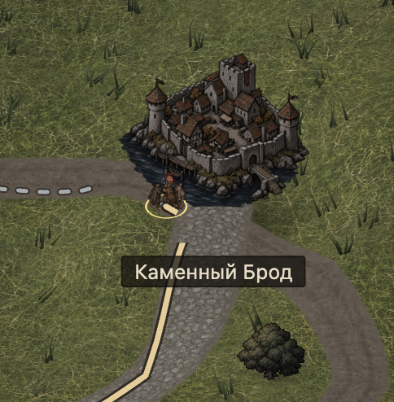

# Техническое задание на обновление текстур карты

Обновить поверхности глобальной карты Warwrit так, чтобы поля, болота и дороги
выглядели частью того же нарисованного мира, что города, деревни и здания.
Результат — цельная игровая карта с выразительной чернильной рисовкой,
достоверными материалами и спокойным фоном, на котором сразу читаются отряд,
путь и места назначения.

**Основание:** прямой запрос владельца от 2026-10-04 и приложенный скриншот.
Единый стиль C и фиксированная камера уже приняты в
[ADR-0006](../architecture/0006-m1-renderer-babylon.md); требования серьёзного
dark fantasy закреплены в [AGENTS.md](../../AGENTS.md).
Состав производства, численные ориентиры и этапы ниже — предлагаемые решения
этого ТЗ. Подготовка документа не означает принятие каждого параметра,
создание новых текстур или завершение игровой проверки.

Оперативный статус хранится в [CURRENT_PLAN](../engineering/CURRENT_PLAN.md).
Связанные геометрия, рельеф, перемещение и прежние результаты принадлежат
[M1-FREE-MOVEMENT](../work-packages/M1-FREE-MOVEMENT.md).
Общий источник географии и лора — [спецификация M1](m1-spec.md), а не рисунки.

## 1. Проблема и ожидаемый результат



На исходном примере город имеет неровные контуры, читаемые каменные формы и
собранные теневые массы. Поле заполнено одинаково плотной сеткой светлых
травинок; земля и мощение воспринимаются как отдельные реалистические
материалы. Из-за различий в характере линий, масштабе деталей и распределении
контраста поселение выглядит наложенным на чужой фон.

Это визуальная оценка приложенного кадра и просмотренных исходных PNG.
По одному кадру нельзя установить качество всей карты, наличие швов во всех
областях, частоту кадров или текущую версию запущенной игры.

После обновления:

- Земля читается крупными неровными пятнами цвета и группами авторских штрихов.
  Детали помогают распознать материал, не превращают поверхность в шум.
- Камень дороги родственен камню города; сухая трава — соломе и растительности
  деревни; мокрая земля и вода — нарисованным речным сценам.
- Дороги входят в ворота и подходы естественно, без обрезанной ленты и ореола.
  Болото переходит в влажный луг и берег через понятную смену материала.
- Карта сохраняет объём существующего рельефа. Стиль не сводится к затемнению,
  размазыванию изображения или добавлению одинаковой бумажной фактуры.
- В обычном масштабе игрок первым замечает отряд и маршрут, затем дороги и
  поселения, затем материал земли. В приближении видна осмысленная рисовка.

## 2. Объём и границы

Главный объём — поле, болото и три существующих покрытия: тропа, грунтовая
дорога, мощёная дорога. Чтобы между ними не остались участки чужой рисовки,
второй этап согласует лесную подстилку, холмы, речной берег, скальную поверхность
и воду. Итого целевой набор — семь базовых поверхностей и три дорожных материала.
Новые игровые типы местности не вводятся.

В работу входят исходные изображения, необходимая настройка масштаба и
смешивания, визуальные обочины и переходы, сопряжение с существующими спрайтами,
проверка освещения и движения. Растительность, камни и другие существующие
декорации проверяются рядом с новой землёй; адресная коррекция нужна только
при подтверждённом конфликте этого обновления.

Не входят: перерисовка поселений и деревьев как самостоятельный проект,
новые биомы, сельскохозяйственная симуляция, сезоны, изменение камеры,
географии, ширины проходимых дорог, скорости, маршрутизации, припасов,
часов, сохранений или правил контрактов. «Поля» здесь — существующая открытая
травянистая земля; пашню и посевы не добавлять без источника для конкретного места.
Тактическое поле боя и интерьеры не обновляются в этом цикле.

## 3. Общий набор художественных ориентиров

Каждый художник и интегратор использует одни и те же перечисленные изображения.
Перед началом их нужно открыть и сравнить, а не ограничиться текстом промптов.
Референсы задают разные свойства; перспективу иллюстрации поселения нельзя
переносить в плоский исходник земли.

| Источник                                                                             | Что брать                                                                                  |
| ------------------------------------------------------------------------------------ | ------------------------------------------------------------------------------------------ |
| [Стиль C](../../assets/art/m1/style/unit-c-ink.png)                                  | Неровная чернильная линия, выборочная штриховка, плотные теневые массы, сдержанная заливка |
| [Город на карте](../../assets/art/m1/map/site-city.png)                              | Камень, земля у основания, масштаб материала рядом с игровым спрайтом                      |
| [Деревня на карте](../../assets/art/m1/map/site-village.png)                         | Сухая растительность, соломенные оттенки, вытоптанная земля и неровный контакт             |
| [Каменный Брод](../../assets/art/m1/places/settlements-v2/kamenny-brod-painting.png) | Семейство камня, грязь между камнями, связь мощения с городскими материалами               |
| [Березняк](../../assets/art/m1/places/settlements-v2/bereznyak-painting.png)         | Земля, солома, осенние травы, жилая деревня с рабочими подходами                           |
| [Тихая Гать](../../assets/art/m1/places/settlements-v2/tikhaya-gat-painting.png)     | Влажная земля, берег, вода и растительность одного рисованного мира                        |
| [Амбары](../../assets/art/m1/places/buildings/granary.png)                           | Достоверные материалы и выборочная детализация; выветривание без игрушечности              |
| [Кадр владельца](references/terrain-style-owner-2026-10-04.png)                      | Исходный конфликт и обязательная композиция для сравнения до и после                       |

Перечисленные изображения просмотрены при подготовке ТЗ. Они служат локальными
ориентирами существующего проекта; это не разрешение копировать чужие игровые
арты или придумывать новый лор.

Поселения сохраняют собственную идентичность и состояние. В частности, опасная
разрушенная Старая мельница не становится действующей живописной мельницей.
Детали на других иллюстрациях не дают права переносить туда рабочее колесо,
посевы или хозяйственную деятельность. Жилые деревни не превращать в руины
для усиления мрачности.

## 4. Художественные требования

### Линия и заливка

Матовая чернильная рисовка с ограниченной цветной заливкой. Контуры неровные,
с переменной толщиной, местами прерываются. Штриховка описывает стык камней,
ком земли, сухую траву и углубление, а не покрывает всю карту одинаковой сеткой.
Тени собираются в несколько читаемых форм. Не обводить чёрным каждую травинку
или каждую крупинку грунта; выразительная линия остаётся у значимых деталей.

Сохранять достоверность размеров и формы: камень выглядит камнем, земля —
уплотнённой или влажной землёй. Исключить фотографическую зернистость,
глянцевый PBR, пластиковый рельеф, мультяшные округлые комочки, яркий газон,
печатный орнамент и одинаково чёрные края всех пятен.

### Цвет и контраст

Палитра объединяет сланец, сажу, умбру, приглушённую охру, серую оливу и
ограниченные ржавые акценты. Тёплое сухое и холодное влажное различаются
внутри этой семьи. Нижеследующие HEX — **предложенные стартовые ориентиры**,
не измеренные цвета референсов и не обязательная перекраска всех артов.

| Назначение               | Стартовый ориентир |
| ------------------------ | ------------------ |
| Чернильная глубина       | `#292822`          |
| Сухая земля              | `#665440`          |
| Приглушённая сухая трава | `#7B7151`          |
| Мох и олива              | `#555B43`          |
| Холодный камень          | `#74756D`          |
| Мокрый торф              | `#44443B`          |
| Тихая вода               | `#4D5A5B`          |

Выбирать окончательные оттенки по составленному игровому кадру с референсами.
Проверять и цвет, и светлоту: низкий контраст фоновых деталей не должен лишать
дороги, берега и болото различимости. Чистый белый и чёрный не заполняют
большие площади поверхности. Ночной вид не сливает болото, тропу и отряд
в одну тёмную массу; отличия формы и структуры сохраняются без неонового контура.

### Масштаб деталей

Три уровня: широкая вариация заливки без узнаваемых повторяемых островов;
средние группы травы, земли или камней; редкая мелкая штриховка. Макровариацию
распределять в мировых координатах существующим материалом, а не повторять
один крупный отпечаток в каждом фрагменте изображения.

Настраивать масштаб по пикселям фактического игрового вида, а не по красивому
PNG в полном размере. Мощение не должно выглядеть валунами размером с человека,
а трава — длинной проволокой. При отдалении мелкие штрихи спокойно исчезают,
сохраняются материал и крупные формы. При плавном приближении нет муара,
мерцания, резкого появления одинаковых кочек или распада общего рисунка.

### Свет и проекция

Плоские исходники материалов рисуются строго сверху, без горизонта,
перспективного сжатия и отдельного направления солнца. Проекцию земли задаёт
существующий рельеф и камера Babylon.js. Не сжимать изображение для изометрии
ещё раз. Допустимы мягкие локальные углубления и чернильные швы; недопустимы
запечённые длинные падающие тени, светлые верхние края каждого камня и блики,
противоречащие игровому свету.

Вертикальные декорации сохраняют принятую проекцию, фактическое соотношение
сторон, корневые привязки и общий свет. Нельзя зеркалить их ради разнообразия.
Освещение дня и ночи применяется в движке; отдельный ночной комплект текстур
не нужен. Существующие объём рельефа и контактные тени сохранить.

## 5. Требования к каждому материалу

| Материал                 | Обязательный рисунок                                                                                                                | Исключить                                                                                    |
| ------------------------ | ----------------------------------------------------------------------------------------------------------------------------------- | -------------------------------------------------------------------------------------------- |
| Поле и луг               | Неровные группы короткой травы, тихие землистые просветы, сухие охристые штрихи среди серой оливы; спокойная заливка между группами | Плотную светлую сетку, одинаковые круглые пучки, сочный газон, крупные одиночные знаки       |
| Болото                   | Тёмная, но читаемая торфяная земля; мягкие грязно-серые водяные пятна, мох и выборочные остатки осоки                               | Чёрную кашу, ярко-зелёную слизь, зеркальные лужи, повторяющиеся большие кочки                |
| Тропа                    | Протоптанный мягкий грунт с немногочисленными корнями и сухими фрагментами, узкое читаемое направление поверх материала             | Две автомобильные колеи, сплошную широкую полосу, каменную мостовую                          |
| Грунтовая дорога         | Уплотнённая умбра, пыль, редкие вдавленные камешки; мягкие следы движения вдоль дороги                                              | Равномерное зерно, асфальтовую гладкость, чёрные параллельные канавы, частые одинаковые лужи |
| Мощёная дорога           | Неровные плоские камни нескольких родственных тонов, выборочные чернильные швы, утопленная земля между камнями                      | Кирпичную сетку, белые швы, валуны, глянцевые грани, одинаковые плитки                       |
| Лесная подстилка         | Умбра, охристые листья и редкие корни, объединённые пятнами; темнее луга, но читается под деревьями                                 | Отдельные нарисованные деревья в текстуре земли, одинаковые листья по всей площади           |
| Холмы                    | Тот же травяной и земляной язык, более сухие участки и редкие каменистые выходы                                                     | Нарисованные перспективные горы, новые террасы и обрывы, вторую систему теней                |
| Речной берег             | Влажная земля, галька, тихая осока; переход из тёплого грунта в холодную воду                                                       | Ровную песчаную рамку, белый кант, одинаковые валуны по границе                              |
| Скала и каменистая земля | Неровные матовые пласты и выборочные трещины, родственные городскому камню                                                          | Шумную фотографию, декоративные руны, светящиеся жилы, новые препятствия                     |
| Вода                     | Приглушённая сланцевая заливка, редкие нарисованные ряби; существующая анимация остаётся слабой                                     | Фотореалистичные отражения, морскую пену на каждой луже, блеск лака                          |

Покрытия должны различаться без подписи и без зависимости только от цвета:
трава — группами штрихов, болото — связью торфа и водяных пятен, тропа — мягким
протоптанным грунтом, грунтовая дорога — уплотнением и следами движения,
мощение — каменными формами. Подписи скорости и существующая легенда остаются.

## 6. Переходы и контакт с окружением

- **Поле — тропа — грунтовая дорога:** трава редеет к вытоптанной земле,
  край неровный, но читаемый. Земля не выглядит размытой прозрачной лентой.
- **Грунт — мощение:** камни входят в земляное основание; у стыка остаются
  грязь и редкие каменные фрагменты. Не создавать ровный светлый бордюр.
- **Луг — болото:** постепенно появляются влажная земля, мох и небольшие
  водяные пятна. Цветовая растяжка сопровождается сменой формы материала.
- **Болото — берег — вода:** естественные мягкие края влажных участков,
  совместимая вода; глубокая река не превращается визуально в доступную сушу.
- **Луг — лесная подстилка:** растительность и листья дают неровный переход
  без прямоугольника, контура скрытой сетки и отдельного тёмного ковра.
- **Поселение — земля:** существующая подложка спрайта сопрягается по тону,
  фактуре и контакту. Ворота, дорожный подход и видимая земля связаны;
  нет светлого ореола, обрезанного основания или полосы дороги поверх стены.

Переходы используют действующие географические маски. Визуальное смешивание
не переносит каноническую границу скорости, препятствий или воды. Если мягкий
край делает границу непонятной, сузить визуальную растяжку и усилить характер
материала, а не перемещать географию.

На поворотах, развилках и сужениях сохраняются ширина, непрерывность и
действующий приоритет перекрытий. На мостах, у бродов и ворот не создавать
новые конструкции или обходы. Не добавлять деревья, высокий камыш или камни
на доступный путь; существующие исключения размещения остаются обязательными.

## 7. Техническое исполнение в существующем движке

### Проверенная точка подключения

Срез текущего локального исходного кода при подготовке: `main`, `bcc30f5`.
Это указатель проверенной версии, не требование откатить будущую реализацию
к ней. Перед работой перечитать новые `CHANGELOG` и `CURRENT_PLAN` и проверить
фактические импорты своего checkout.

- [art.ts](../../apps/web/src/renderer/art.ts) подключает семь материалов
  `world-v2` и дороги `roads-v1`. Луговая поверхность — именно
  `world-v2/grass-meadow.png`, а не старый `grass.png`.
- [terrain-material.ts](../../apps/web/src/renderer/terrain-material.ts)
  владеет смешиванием земли и шейдером дорог. Естественные материалы используют
  повёрнутые внутренние фрагменты с плавными весами; дорожный материал
  уже содержит продольные координаты, следы износа и отдельную обочину.
- [map-roads.ts](../../apps/web/src/renderer/map-roads.ts) остаётся владельцем
  видимой дорожной геометрии. [continuous-map-scene.ts](../../apps/web/src/renderer/continuous-map-scene.ts)
  соединяет поверхности, спрайты и свет; [map-life.ts](../../apps/web/src/renderer/map-life.ts)
  размещает существующие декорации.
- [assets/manifest.json](../../assets/manifest.json) и соседние JSON хранят
  действующую регистрацию и происхождение изображений. Старая
  `world-v2/road.png` не является текущим источником трёх дорог.

Граф кода не вернул эти модули и не предоставил проверяемую свежесть индекса;
выводы выше основаны на чтении фактических файлов, а не на старом графе.

### Разделить свободную фактуру и направленные детали

Существующее случайное вращение фрагментов подходит для земли, коротких трав,
торфа и ненаправленных камней. Оно разрушает запечённые колеи, ряды кладки,
теневые направления и вытянутые потоки воды.

Поэтому базовые текстуры должны быть ненаправленными. Продольное уплотнение,
колеи и следы движения сохранять в дорожных координатах, как в текущем
шейдере. Не рисовать вторую пару колей в PNG. Если мощению действительно
нужны продольные ряды, добавить ограниченный режим без случайного вращения
только для него и проверить повороты; не переделывать систему всей карты.
Маски направления отделить от цвета, если существующего шейдера недостаточно.
Это условная техническая мера после проверки, не обязательный новый пакет.

Материалы привязаны к миру: при панорамировании земля не скользит по экрану,
при приближении не меняется расположение пятен. Разнообразие воспроизводимо
после перезагрузки. Бумажный шум поверх экрана не заменяет материал земли.
Сохранить плавное смешивание; проверить, что оно не превращает чернильные
штрихи в мутные двойные контуры.

### Формат и поставка

Предлагаемый старт: одна квадратная полноцветная PNG на материал, рабочий
экспорт 1024×1024, без прозрачности и рамки. Более крупный исходник сохранять
отдельно без потери оригинала; реальный размер записывать честно. Повышение
до 2048×2048 оправдывается только видимым недостатком в ближайшем масштабе
и измерением памяти. Число вариантов увеличивать после подтверждённого повтора,
а не заранее по норме.

Цветовые текстуры используют действующий sRGB-путь; управляющие маски —
линейные данные. Окончательно проверять цвет после текущей обработки gamma,
освещения, травяного tint и дорожного износа. Старые корректирующие тонировки
не должны повторно затемнять уже согласованный арт. Mipmap и фильтрация
проверяются в движении; подобрать масштаб и фильтр до добавления новых карт.
Карты normal, roughness, displacement и новый PBR-конвейер не обязательны.

Для каждого нового материала поставить:

1. Оригинальный исходник и потребляемый экспорт, если они различаются.
2. Соседний JSON: назначение, точный промпт, переданные референсы, инструмент,
   фактический размер, лицензия/происхождение, выполненные правки и ограничения.
3. Запись в существующем реестре ресурсов и фактическое подключение в `art.ts`.
4. Для интеграции — установленный масштаб в мире и режим повторения/смешивания.
   Для направленного материала — ось, UV и разрешённые преобразования.
5. Парные игровые кадры до/после и результат независимой проверки.

Предлагаемая папка нового комплекта — `assets/art/m1/terrain-ink-v1/`.
Исторические ресурсы не удалять до проверки потребителей. Старые утверждения
в provenance не переписывать как результаты нового комплекта. Не создавать
второй реестр ресурсов, хеш-манифест или отдельный демонстрационный движок.

## 8. Задание художнику и генерация

Единая основа технического промпта приведена на английском как рабочее задание
для инструмента. Художественный результат оценивается по разделам выше.
Во все запросы передавать одинаковые просмотренные style C, городской и
деревенский спрайты; для влажных материалов также Тихую Гать. Иллюстрации
служат ориентирами манеры и материала, не композиции плоской текстуры.

```text
Create one original ground albedo texture for Warwrit's existing 2.5D world map.
Use the supplied Warwrit images as style and material references only.
Match their irregular ink contours, selective hand hatching, grouped shadow
shapes and restrained flat earthy washes. Serious, grounded dark fantasy;
credible worn materials, quiet background contrast, no cute or toy-like forms.
Material: [insert one material brief from section 5].
Square flat surface, perpendicular overhead view, edge to edge, no horizon.
No painted isometric projection, directional sunlight or cast shadows.
Use broad quiet washes, irregular medium-scale forms and sparse deliberate
detail. Avoid photographic grain, dense uniform line meshes and glossy PBR.
Keep the base nondirectional because the engine blends rotated interior patches.
No wheel ruts, ordered paving rows, large landmarks, perspective objects,
people, buildings, trees, symbols, writing, borders or watermarks.
Produce a coherent material, not a complete scene or a montage of tiles.
Preserve compatible average values at the edges; no vignette or edge frame.
```

Содержимое `Material` берётся из конкретной строки раздела 5. Для поля явно
указать короткие сгруппированные травяные штрихи и видимые тихие промежутки;
для болота — мягкие торфяные формы и небольшие водяные пятна; для мощения —
плоские неровные камни с выборочными швами. Слово «dark» не заменяет эти формы.

Если понадобится отдельная направленная маска, это самостоятельный запрос:

```text
Create a flat grayscale road wear mask, not a colored ground image.
White marks wear influence; black marks no influence.
Road length runs vertically through the image. Use soft interrupted longitudinal
compression: one central worn passage for a foot trail, or two restrained
irregular wheel tracks for a dirt road. Specify only one road type per image.
No shading, perspective, scenery, horizontal tracks or recognizable repeated
marks. Top and bottom must join continuously. Keep it compatible with the
existing road-coordinate shader; do not bake these tracks into the base albedo.
```

Генерация даёт кандидата, а не принятый ресурс. Проверить целый исходник,
повтор в материале и составленный кадр. Обещание «seamless» в промпте не
доказывает отсутствие швов. Для существующего смешивания важны внутренние
фрагменты; если выбран обычный тайлинг, отдельно проверить обе пары краёв.

## 9. Производственные этапы и ответственность

Один интегратор владеет шейдерами, импортами, реестром и общими документами.
Художник владеет только назначенными материалами; при нескольких исполнителях
у каждого свой набор ресурсов и один общий референс. Независимый критик
читает и смотрит результат, не редактирует его. Это схема будущей работы,
не запуск исполнителей в рамках подготовки ТЗ.

| Этап                                        | Видимый результат и способ попробовать                                                                                                                           | Условие перехода                                                                                             |
| ------------------------------------------- | ---------------------------------------------------------------------------------------------------------------------------------------------------------------- | ------------------------------------------------------------------------------------------------------------ |
| 1. Согласовать рисовку на небольшом участке | В действующей игре у Каменного Брода поле и все три покрытия стоят рядом с исходным городом; отдельный существующий болотный участок показан с тем же комплектом | Независимый критик сравнил референсы и день/ночь в обычном и близком виде; исправлены материальные конфликты |
| 2. Довести пять основных материалов         | Поле, болото, тропа, грунт и мощение работают на всей существующей карте; можно пройти дорогу, свернуть на луг и остановиться у болота                           | Нет заметных повторов, сломанных поворотов, чужой рисовки или потери читаемости в проверенных сценах         |
| 3. Согласовать соседние поверхности         | Подстилка, холмы, берег, скала и вода завершили общий язык; подходы к деревням и реке выглядят цельно                                                            | Критик повторно проверил изменённые результаты, география и контакты сохранены                               |
| 4. Закрыть интеграцию                       | Реальный путь, STOP, новый путь и перезагрузка доступны в текущем клиенте; комплект и ограничения задокументированы                                              | Выполнены приёмочная матрица, применимые проверки и измерение влияния на клиент                              |

Первый участок не отдельный макет. Географию не перекладывать ради соседства
всех покрытий: для отсутствующего рядом материала открыть другой действующий
участок. Не производить полный набор вариантов до первого приемлемого результата.
Если цикл не даёт пригодного кадра, сначала исправить рисовку и интеграцию,
не добавлять декорации, новые системы или дополнительные биомы.

## 10. Приёмочная матрица

Художественная приёмка проводится на текущем интегрированном клиенте, а не
на листе отдельных PNG. В парных кадрах сохранять одинаковые камеру, масштаб,
размер окна, DPR и фазу света. Критик получает точную версию клиента, реальные
кадры и запись выполненного путешествия; границу собственного осмотра указывает
явно. Автор исправляет подтверждённые дефекты и возвращает затронутые сцены
тому же критику. Вкус и удовольствие от игры отделять от дефектов.

| Сцена                                                | Что обязательно проверить                                                                             |
| ---------------------------------------------------- | ----------------------------------------------------------------------------------------------------- |
| Каменный Брод и входящая дорога                      | Связь камня города с мощением, земля у основания, ворота и путь, отсутствие исходного травяного узора |
| Березняк и открытая земля                            | Трава рядом с соломой/деревом, естественный подход, отсутствие отдельного зелёного ковра              |
| Тихая Гать и существующее болото                     | Торф, берег и вода различимы; мох и камыш в общей манере; нет ложного сухого пути                     |
| Северный Двор                                        | Сухая земля и трава рядом с хутором; никакой новой пашни без источника                                |
| Старая мельница                                      | Влажные контакты и дорожный подход; исходные руины и опасное состояние сохранены                      |
| Длинный участок каждого покрытия, поворот и развилка | Масштаб камней/земли, повтор, отсутствие поперечных колей, непрерывная обочина и согласованный стык   |
| Опушка, холм и скала                                 | Соседние материалы не выглядят из другого набора; объём рельефа не потерян                            |
| Отряд на всех пяти основных материалах               | Различимы фигура, кольцо, цель и обе части маршрута; текст не исчезает на шумной земле                |

Для каждой статичной сцены: день и ночь × обзорный, обычный и близкий масштабы
в пределах действующей камеры. Для короткого реального пути: день и ночь,
обычный масштаб и хотя бы один панорамный/зум-переход. В ночных кадрах не
подменять фазу подписью; зафиксировать фактический режим.

На основном MacBook/Chrome проверить DPR1 и DPR2, полный игровой размер окна
и узкий поддерживаемый вид. Если часть матрицы не выполнена, перечислить
точные пропуски как `NOT_RUN`; просмотр PNG не закрывает игровой пункт.

### Условия принятия

1. Независимый критик не находит материального стилевого или лорного конфликта
   в предъявленной матрице: линия, материал, проекция и свет согласованы.
2. В обычном и обзорном виде нельзя увидеть сетку тайлов, обводку биомов,
   одинаковый повторяемый знак, резкую склейку или ореол поселения.
3. При медленном pan/zoom земля не мерцает и не скользит; мощение не распадается
   на шум, штрихи не образуют муар. Материал не выглядит размытым после смешивания.
4. Все основные покрытия распознаются по рисунку; маршрут и отряд читаются
   днём и ночью. Никакие декорации не мешают выбору цели и управлению.
5. Реальный путь по дороге и съезд на землю, STOP, повторный выбор цели,
   прибытие и перезагрузка сохраняют прежнее корректное поведение. Новые
   ресурсы не создают неизвестных проходов, препятствий или скоростей.
6. Нет новых ошибок загрузки ресурсов/шейдеров и браузерных ошибок в
   проверенном пути; реестр и provenance соответствуют потребляемым файлам.
7. Влияние на время кадра, память и загрузку измерено. Непроверенная
   производительность не объявляется пройденной.

### Производительность и проверки

Сначала измерить базовую версию и кандидат на одном устройстве, в одной сцене,
при одинаковых настройках и без посторонней сборки. Предлагаемый минимальный
прогон: по 60 секунд pan/zoom и движения после прогрева. Записать устройство,
браузер, размер окна/DPR, медиану и p95 времени кадра, число новых текстур,
оценку их памяти и объём загрузки. Время рендера CPU не выдавать за GPU FPS.

Предлагаемый порог для разбора регрессии: воспроизводимый рост p95 времени
кадра более чем на 10% относительно базы. Это рабочий ориентир ТЗ, не прежняя
гарантия производительности. Единичный скачок перепроверить в сопоставимых
условиях. Если показатель нельзя измерить, записать `NOT_MEASURED` и причину.
Новая перцептивная проблема — рывки, долгая первая загрузка или зависание —
требует исправления независимо от процента.

При реализации выполнить существующую валидацию ресурсов, web typecheck/build
и проверки затронутых файлов. Существующие проверки проекции/камеры запускать,
если менялись соответствующие потребители; тесты движения — если затронута
дорожная геометрия. Не добавлять тест на каждый PNG или декоративный параметр.
Финальный полный gate интегрированного игрового кода — один раз по действующему
bootstrap-контракту; он не заменяет художественную приёмку.

## 11. Основные риски и действия

| Риск                                                          | Как устранить                                                                                                       |
| ------------------------------------------------------------- | ------------------------------------------------------------------------------------------------------------------- |
| «Чернильность» превратилась в сплошную чёрную сетку           | Укрупнить заливку, сделать линии выборочными; проверить обычный и обзорный вид                                      |
| Новый материал согласован в PNG, но искажён tint/gamma/светом | Сравнивать интегрированный кадр; адресно согласовать старую коррекцию цвета                                         |
| Вращение разворачивает колеи или свет                         | Ненаправленный albedo; следы движения в дорожных UV; отсутствие падающих теней в источнике                          |
| Смешивание съедает выразительность линии                      | Сначала настроить масштаб и веса существующего материала, затем решать необходимость нового режима                  |
| На границе нарисована ложная дорога или суша                  | Сохранить географические маски, сузить декоративный край и проверить реальные цели                                  |
| Добавленная растительность перекрывает путь и ввод            | Сохранить исключения размещения и неперехватывающие ввод декорации                                                  |
| Все поверхности выглядят одинаково грязными                   | Развести структуры травы, торфа и камня, сохранив общую палитру                                                     |
| Выросли память и загрузка                                     | Сначала один материал каждого типа и текущая система смешивания; повышать размер только по измеренной необходимости |

## 12. Результат подготовки ТЗ

2026-10-04: создано локальное ТЗ по запросу владельца; исходный кадр сохранён
без изменений как документальный референс. Проверены перечисленные изображения,
действующие импорты и принципы смешивания земли/дорог. Старые художественные
проверки не перенесены на будущий комплект. Новые игровые правила и лор
не предложены.

Редакторская проверка: 12 основных разделов, 20 относительных ссылок на
существующие цели, сохранённый референс и четыре навигационных/status-ссылки
проверены — PASS. Первый Prettier check выявил форматирование таблиц — FAILED;
таблицы отформатированы, повторный check — PASS. Scoped diff-check — PASS;
прочитаны итоговые разделы и дополнения в общих документах. Параллельно
появившиеся изменения игрового кода не принадлежат этой задаче и сохранены;
перед внедрением обязательна проверка актуального checkout.

Производство новых
текстур, интеграция, независимая игровая критика, браузерная матрица и игровые
проверки — `NOT_RUN`; влияние на производительность — `NOT_MEASURED`.
Live Airtable, Empirical и GitHub не перечитывались: документ не меняет
канонические игровые решения и не утверждает текущую CI/merge-готовность.
Публикация и merge этим запросом не разрешены.

## 13. Реализация — 2026-10-04

Прямой запрос владельца «Implement …terrain-art.md with best practices and
subagents» активировал реализацию этого ТЗ. Численные ориентиры выше остаются
предложениями, пока результат не проверен. Изменения локальны в primary `main`
на базе `bcc30f5`; чужие изменения маршрута, документов и skills сохранены.
Родитель — единственный автор ресурсов, подключений и общих документов;
исследователь интеграции и независимый критик работают только на чтение.

Первый комплект расположен в
[terrain-ink-v1](../../assets/art/m1/terrain-ink-v1/): луг, болото, тропа,
грунт и мощение. Для каждого материала сохранены оригинальная PNG 1254×1254
без правок и соседний JSON с точным промптом, четырьмя одинаковыми переданными
референсами, инструментом, действительным размером, происхождением и режимом
смешивания. Запрошенный размер 1024×1024 не выдан за размер результата.
Пять новых записей добавлены в прежний `assets/manifest.json`; исторические
ресурсы сохранены. Новые импорты в `art.ts` используют существующие слоты.

Старое смешивание луга с однотонным цветом на 38% удалено: новое изображение
уже содержит согласованную земляную заливку. Непрерывные повёрнутые внутренние
фрагменты, масштаб, фильтрация, макровариация, свет и продольный дорожный износ
сохранены. Геометрия, границы местности, скорости и управление не изменены.
Лесная подстилка, холмы, берег, скала и вода ещё используют прежние ресурсы;
их производство следует после первой интегрированной художественной проверки.

Первый независимый осмотр исходников и пяти PNG не установил конкретного
дефекта. Размер камней мощения требует проверки в клиенте. Это предварительная
критика ресурсов, не художественная приёмка карты: актуальные кадры нового
комплекта, реальное путешествие и полная матрица пока `NOT_RUN`.

### Проверки и ограничение доступа

- Web typecheck, валидация реестра (79 ресурсов), scoped ESLint/Prettier — PASS.
- Production web build — PASS; прежнее предупреждение о большом JS chunk
  сохранено. Новых зависимостей и изменений build-конфигурации нет.
- Финальный doc formatting check сначала FAILED на лишних пустых строках
  существующего wiki index; исправлены только эти строки, повторный check — PASS.
- Сохранены базовые дневной и ночной кадры у Каменного Брода. Ночной кадр
  назван по фактической фазе света; будущие парные кадры ещё не получены.
- На Apple M3 Pro / Chromium154 / 1440×1000 / DPR1 выполнено 60 секунд
  **стационарного** наблюдения базовой версии: 5705 интервалов requestAnimationFrame,
  медиана 8.4ms, p95 16.8ms. Это частота браузерных callbacks, не GPU-время и
  не прогон движения/pan/zoom. Кандидат и сравнительная производительность —
  `NOT_MEASURED`. Прямая попытка измерения через browser read-only evaluate
  не сработала: API не предоставляет `performance`; временная HTML-обёртка
  запустила тот же клиент и получила только базовое наблюдение; обёртка удалена.
- Пять замен сохраняют размеры 1254×1254: оценка RGBA8 с mipmap —
  41,933,760 байт суммарно, столько же, сколько для заменённых пяти карт.
  Размер PNG вырос с 17,810,809 до 18,496,592 байт (+685,783 байт).
  Это размер файлов и расчёт памяти текстур, не измерение полной GPU/JS памяти.
- Сеанс игры истёк перед осмотром кандидата. Automatic approval review
  отклонил отправку документированного локального test login, потребовав
  явное разрешение для этого запроса. Владельцу задан вопрос о входе как
  `player-two` и коротком пути дорога → луг / STOP / reload; ответ ожидается.
  Отправка логина не повторялась другим способом; положение и припасы
  сохранённой компании не менялись.

Публикация, merge, deployment и платные ресурсы не разрешены этим запросом.
До текущей интегрированной критики и оставшихся пяти поверхностей реализация
ТЗ не завершена. Полный чистый bootstrap и новые игровые/DB проверки —
`NOT_RUN`; прежние результаты других веток на этот комплект не перенесены.
