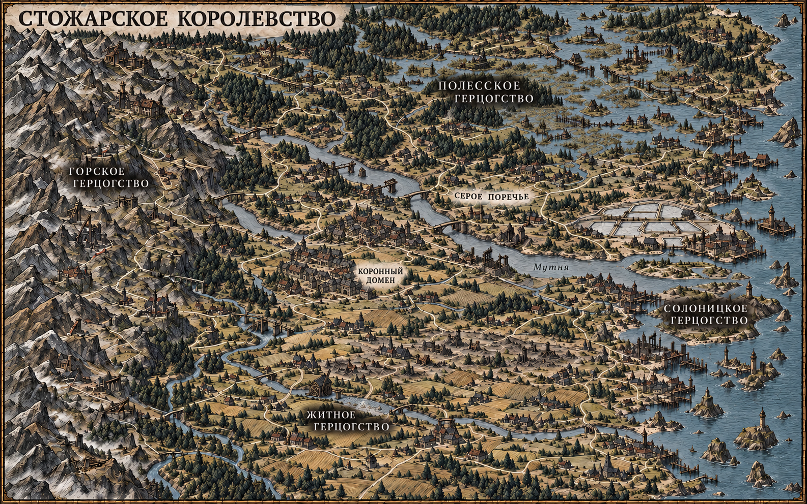

# Глобальная карта

Владелец попросил: «Продумай и подготовь глобальную карту — сгенерируй
изображение мира в соответствии с лором». Результат этого цикла — обзорный
атлас королевства, который можно открыть целиком и рассмотреть крупно.

Первая версия: [атлас пяти опорных городов](../../../assets/art/world/stozhar-v1/world-map.png).
После просмотра владелец потребовал больший масштаб и содержательное
разнообразие мест; эта версия сохранена как промежуточный рисунок.

## Основание и границы

Большой MMO-мир воюющих герцогств — решение владельца. Базовые имена королевства,
столицы, герцогств и их городов взяты из [мира](index.md) и
[таблицы герцогств](../../content/world/duchies.csv); их прежний статус
авторского предложения сохраняется. Дополнительные города и местности ниже
предложены для расширенного атласа по запросу владельца. Новых государств,
правителей, верований, чудовищ и датированных исторических событий карта не вводит.

Точные очертания, размеры земель, расположение городов внутри герцогств,
береговая линия, водосбор и межрегиональные дороги предложены для этого
рисунка. Течение Мутни с запада к восточному устью — связующее решение
композиции, а не уже установленный факт лора. Расположение Поречья на
Мутне и между Житным и Полесским герцогствами взято из
[страницы Поречья](porechye.md).

Владелец требует десятки часов игры и более 100 точек интереса
([REQ-20](../vision.md#масштаб-мира--2026-10-08)). Длина в километрах,
скорость переходов и фактическое время исследования пока не измерены. Земля продолжается за
северной, западной и южной рамками; соседние страны не названы. Восточное
побережье развивает уже указанную морскую торговлю Солоницы.

## Устройство рисунка

| Часть                          | Местность и опорный город                 | Связь с остальными землями                            |
| ------------------------------ | ----------------------------------------- | ----------------------------------------------------- |
| Север — Полесское герцогство   | Леса, болота, просеки; Дубровь            | Выход к спорной речной полосе                         |
| Юг — Житное герцогство         | Чернозём, полосы полей, пастбища; Колосов | Дороги к переправе и столице                          |
| Запад — Горское герцогство     | Горы, рудники, перевалы; Кремень          | Обозные дороги из горных долин                        |
| Восток — Солоницкое герцогство | Соляные озёра, устье, порт; Солоница      | Речной и сухопутный путь из внутренних земель         |
| Центр — коронный домен         | Небольшая территория; Белоречь            | Дороги между пятью опорными городами                  |
| Серое Поречье                  | Узкая полоса вдоль Мутни; Каменный Брод   | Житное и Полесское соприкасаются у каменной переправы |

Поречье занимает малую часть королевства: первый игровой регион не должен
выглядеть как весь мир. Березняк, Тихая Гать, Северный Двор и Старая
мельница отмечены в увеличиваемом атласе; это обзорные привязки района,
а не замена координат действующей игровой карты. Старая мельница
остаётся опасной сгоревшей руиной.

Различие земель задают рельеф и хозяйство. Тонкие прерывистые границы
показывают предложенное деление земель; ржаво-серая штриховка Поречья —
спорную полосу. Текущая линия фронта, захваты и положение войск не заданы.
Поселения преимущественно обитаемы; следы войны точечны.

## Большой мир — поправка владельца 2026-10-08

После первой версии: «Какая-то маленькая карта — масштаб должен быть больше —
больше городов, деревень, продумай места, разорённые войной, болота и пр. —
сделай мир интересным, не шаблонным».

Пять городов и четыре однообразные полосы биомов недостаточны. Новый рисунок
должен показывать 24 городских узла, около 120–160 небольших деревенских
групп, три самостоятельных речных бассейна и несколько разных округов
внутри каждого герцогства. Это художественное задание, а не измеренная
численность населённых пунктов или новое правило генерации игрового мира.
Новые реки, кроме Мутни, пока без названий. Поречье занимает примерно
3–4% изображённой суши; размер не задаёт реальные километры.

Горные хребты разбиты долинами и предгорьями. Полесье сочетает сухие лесные
гряды, озёрные берега, торговые речные долины и один большой болотный район.
Житное включает сады, луга, пастбища, пашни и локальную разорённую полосу.
В Солоницком два крупных соляных бассейна соседствуют с живыми устьевыми
и морскими округами. Границы следуют местности; столица не служит центром
симметричной звезды дорог.

### Города и округа

Первые пять столиц и Каменный Брод взяты из имеющихся страниц; остальные
18 городов — новые предложения. Типы и состояние дополнительных мест
не вводят готовых заданий, наград или права захвата.

| Земля          | Город         | Что отличает его округ                                    |
| -------------- | ------------- | --------------------------------------------------------- |
| Горское        | Кремень       | Столичный узел действующих рудников и горных обозов       |
| Горское        | Крутояр       | Долинный рынок перед узким перевалом                      |
| Горское        | Железец       | Рабочие рудники, отвалы, посёлки вдоль служебных дорог    |
| Горское        | Гранск        | Высокая обитаемая котловина с полями и каменными дорогами |
| Горское        | Вадич         | Живой город на краю покинутого добывающего округа         |
| Полесское      | Дубровь       | Столица среди лесных торговых долин                       |
| Полесское      | Стрежень      | Речной торг на северном водном пути                       |
| Полесское      | Шишково       | Лесные дворы и смолокурни у сухой гряды                   |
| Полесское      | Островец      | Озёрный берег, пристани и деревни на возвышенностях       |
| Полесское      | Чёрный Плёс   | Посад у болотного водосбора и деревянной гати             |
| Житное         | Колосов       | Главный хлебный рынок юга                                 |
| Житное         | Добрино       | Сады и пастбища в защищённых долинах                      |
| Житное         | Луговец       | Сенные луга, конные дворы и большой перекрёсток           |
| Житное         | Медов         | Садовые деревни между полями и лесистыми холмами          |
| Житное         | Рожин         | Уцелевший рынок у края разорённой хлебной полосы          |
| Солоницкое     | Солоница      | Главный торговый порт в устье Мутни                       |
| Солоницкое     | Устье         | Другой устьевой округ, рыболовные дворы и малые причалы   |
| Солоницкое     | Соляной Посад | Внутренний рынок соляных озёр и дорог по дамбам           |
| Солоницкое     | Плотов        | Речные склады и дворы на наносных островах                |
| Солоницкое     | Ладейск       | Второй морской торговый город в защищённой бухте          |
| Коронный домен | Белоречь      | Столица и монетный двор                                   |
| Коронный домен | Городец       | Живой рынок на пересечении межрегиональных путей          |
| Коронный домен | Вязов         | Разбитые городские кварталы и уцелевший речной посад      |
| Поречье        | Каменный Брод | Низкая каменная переправа, связывающая север и юг         |

### Места, которые меняют устройство пути

| Место                 | Что видно на карте                                                                    | Зачем идти туда или выбирать другой путь                       |
| --------------------- | ------------------------------------------------------------------------------------- | -------------------------------------------------------------- |
| Глухие топи           | Торфяной болотный водосбор, сухие обитаемые острова, длинная гать с провалом          | Деревни близки по прямой, но связаны большим обходом           |
| Пустые штольни        | Покинутые шахтные дворы, отвалы и оборванная служебная дорога рядом с живым городом   | Добывающий округ отличается от работающих соседних долин       |
| Узкий перевал         | Две каменные гряды, серпантин и небольшая обитаемая крепость над дорогой              | Дальний торговый путь сходится в одном проходе                 |
| Горелая межа          | Полоса разорённых деревень и заросших полей вдоль старого обозного пути               | Путь через хлебный край пересекает местную зону разрушений     |
| Вязов                 | Кварталы без крыш, уцелевший посад, разрушенная переправа и обход к Караульному мосту | Повреждённый городской узел вынуждает менять маршрут           |
| Горелая пристань      | Обугленные сваи, пустые склады, дорога, теряющаяся в кустах                           | Заброшенный причал соседствует с действующей портовой сетью    |
| Островные дворы       | Сады, дома на поднятом грунте, причалы и мостки на наносных островах                  | Поселения связаны водой и короткими переходами между островами |
| Размытый старый тракт | Прямой участок каменной дороги в лесу, разбитый мост, новая грунтовая дуга            | Видна причина, почему нынешняя дорога длиннее прежней          |
| Соляные озёра         | Два крупных бассейна, дамбы, соляные сараи и тростниковые дворы                       | Посады соединены узкими сухими коридорами                      |
| Садово-луговая полоса | Обитаемые долины между Добрино и Луговцом, ярмарочный перекрёсток                     | Живой хозяйственный район даёт контраст разрушенным округам    |

Война оставляет разные следы: потерянная переправа, пустой склад, сгоревший
амбар, заросший участок пашни, новый дом у старого пепелища. Не назначаем
им виновника или новую битву. На карте остаются работающие рынки и рудники,
рыбацкие дворы, дороги и восстановление. Ни одна область не состоит только
из одного ресурса или одного типа разрушений.

Дороги образуют местные петли и несколько дальних связей: рудники →
перевалы → хлебные рынки → речные и морские порты. Тупиковая дорога
упирается в шахту, гать или разрушенный узел по видимой причине. Это
пространственная композиция для будущего исследования, а не реализованная
механика проходимости или снабжения.

## Художественная поставка

Север сверху, горизонтальный атлас примерно 16:10. Это обзорная иллюстрация;
фиксированная 3/4-камера игрового клиента по ADR-0006 сохраняется.
Чернильный контур, штриховка, плотные тени и плоская приглушённая заливка
следуют стилю C. Референсы:

- [unit-c-ink.png](../../../assets/art/m1/style/unit-c-ink.png);
- [Каменный Брод](../../../assets/art/m1/places/settlements-v2/kamenny-brod-painting.png);
- [Старая мельница](../../../assets/art/m1/places/staraya-melnitsa.png).

Палитра: сланец, сажа, умбра, приглушённая охра, выцветшая олива,
немного ржавого. Материалы — тёмная черепица, старое дерево, неровный
камень; поля и леса различимы без ярких цветных заливок владений.

Точный [английский запрос](../../../assets/art/world/stozhar-v1/prompt.txt)
сохранён рядом с [рисунком](../../../assets/art/world/stozhar-v1/world-map.png)
и [происхождением](../../../assets/art/world/stozhar-v1/provenance.json).
Генерация — встроенный `imagegen`;
референсы просмотрены автором и описаны в запросе. Они не переданы как
изображения-мишени для редактирования.

## Результат и проверки — 2026-10-08

Первый рисунок сгенерирован встроенным `imagegen`: 1536×1024, непрозрачный
PNG. На запрос предпочтительного 3072×2048 инструмент вернул меньший размер;
увеличение разрешения не выполнено.

Независимый `warwrit_visual_critic` просмотрел рисунок, три референса и две
сравнительные таблицы одинаковой высоты. Первый проход: **REJECT**.
Материалы/износ — 1: Каменный Брод выглядел высоким светлым замком вместо
старого торгового города. Лор — 1: Мутня была синей вместо пепельно-серой.
Остальные применимые критерии — 2; движение не относится к неподвижному
атласу. Для исправления запрошены новая низкая городская композиция у
переправы, серый ил в реке и более плотные нерегулярные тени у опорных
городов. Точный [запрос исправления](../../../assets/art/world/stozhar-v1/edit-prompt.txt).
Исправленная версия получена: Мутня серая, у Каменного Брода низкая
каменная переправа и плотная группа тёмных крыш. Второй полный проход
статичного атласа: **ACCEPT**, применимые оценки 2/3/2/2/2/2/3; движение N/A.
Владелец затем отклонил достаточность масштаба: первой версии недостаточно
городов и разных мест. Это не отменяет исправления материалов и лора,
но блокирует завершение запроса до расширенной версии.

Расширенный атлас получен: **1586×992**. На рисунке нанесены новые города,
болотный округ с гатью, разорённый Вязов и хлебная полоса, покинутые штольни,
работающие и разрушенный порты. Точный
[запрос](../../../assets/art/world/stozhar-v2/prompt.txt),
[изображение](../../../assets/art/world/stozhar-v2/world-map.png),
[происхождение](../../../assets/art/world/stozhar-v2/provenance.json).
Независимая оценка второй версии: **REJECT**, мелкие подписи терялись
на обзоре; потребовалась увеличиваемая подача. Число деревенских групп и доля суши
Поречья **NOT_MEASURED**; изображение не является координатным каталогом мира.

Проверка новых локальных ссылок (10) и `git diff --check` прошли.
Форматирование изменённых документов и provenance выполнено.
Игровые тесты и подключение к клиенту — **NOT_RUN**: этот цикл меняет только
иллюстрацию и её описание. День/ночь и движение в игровом окружении не
проверены; полная интегрированная приёмка по VISUAL_CRITIQUE — **BLOCKED**
до отдельного цикла подключения. Это не препятствует оценке статичного
концепта по применимым критериям и не означает приёмку игровой карты.

## 128 мест и проверка географии — 2026-10-08

Последующие требования владельца:

> Игра должна быть рассчитана на десятки часов — текущая карта всё ещё
> маленькая, нужно более 100 точек интереса.
> Ещё раз перепроверь карту и расположи все элементы на ней логично —
> проверь дороги, леса, болота, мосты, деревни, поля и пр.

Текущая версия — [увеличиваемый атлас](../../../assets/art/world/stozhar-v3/atlas.html)
с поиском, фильтрами и выбором места. Его [каталог](../../../assets/art/world/stozhar-v3/places.json)
содержит **128** уникальных мест: 24 города, 40 деревень/хуторов,
18 следов войны, 16 природных мест, 16 дорожных узлов, 14 промысловых
и хозяйственных мест. У каждого места есть отдельное описание и связи.
Это точный счёт каталога и выбираемых меток; он не означает, что генератор
изображения создал ровно 128 различимых поселений.

Каталог владеет именами, типами и координатами. В HTML включена его
неизменяемая копия для автономного открытия; обновлять её из JSON.
Координаты — проценты рисунка с севером сверху, а не километры или
координаты игровых сущностей. Кнопки связанных мест — навигация атласа,
а не реализованный маршрут компании. На обзоре показаны значки; при
увеличении — подписи городов, остальные подписи при выборе/наведении.

### Логика размещения

- Мутня идёт по центральной долине к восточному устью, её вода
  пепельно-серая. Большая речная петля вокруг столицы убрана; вместо неё
  сухая терраса с полями и дорогами. Северный озёрно-болотный водосбор
  и южная сельскохозяйственная речная долина образуют другие округа.
  Северные озёра, сухие гряды и болото различаются по растительности.
- Дороги следуют долинам, сухим террасам, перевалам и краю полей.
  Переправы привязаны к нарисованным берегам: подходы соединяются
  с мостом, бродом или пристанями. Горные подъезды обходят скальные
  уступы; рабочие и покинутые выработки находятся у своих подъездов.
- Вязов стоит у разрушенного пролёта на верхней Мутне. Обход идёт
  береговой дорогой к ближайшему Караульному мосту; дальше путь ведёт
  к Каменному Броду. Нижний перевоз
  относится к нижнему течению и больше не объявлен местным обходом Вязова.
  Караульный мост имеет деревянный настил на старых опорах: единственная
  каменная тележная переправа **Поречья** остаётся у Каменного Брода.
- Длинная гать пересекает болотный комплекс между сухими островами,
  один участок прерван. Деревни и сады — на поднятом грунте; обычная
  пашня не назначена открытому болоту. Леса занимают сухие гряды и
  склоны, тростник — мокрые кромки.
- Южные поля сгруппированы вокруг дворов на пологой сухой земле.
  Низкие речные берега — покосы и выпас; сады близки к поселениям,
  лесные опушки остаются за пашней. Новая водяная мельница, Луговой
  брод и Сенной мост находятся на южной речке; разбитая плотина —
  на её верхнем притоке. Они не заменяют Старую мельницу Поречья.
- Соляные дворы стоят у двух соляных бассейнов, дороги проходят
  по береговым дамбам. Порты и рыбацкие дворы привязаны к береговым
  причалам, островные дома — к сухим наносам и лодочным сходам.
  Рабочие пристани отделены от обгоревших складов.
- Следы войны сосредоточены в разорённой хлебной полосе и отдельных
  повреждённых узлах. Сохраняются живые города, поля, рабочие рудники
  и порты. «Выжженный бор» заменён предложением «Брошенная делянка»:
  рисунок показывает пустые лесные дворы, а не сплошь сгоревший лес.

Проверка выполнялась по рисунку в увеличении, с последовательной
привязкой всех 128 мест к постройкам, сухому грунту, воде или дороге.
Первый независимый проход третьей версии выявил метки столицы на
надписи, брод/мост и водяные хозяйства на суше, неясную привязку Вязова.
Для исправления изменены центральная гидрография, локальные сооружения
и привязки каталога; новое изображение сохранено отдельно от чернового.

### Происхождение и пределы результата

[Исходный запрос](../../../assets/art/world/stozhar-v3/prompt.txt),
[правка географии](../../../assets/art/world/stozhar-v3/geography-edit-prompt.txt),
[правка переправ и водяных хозяйств](../../../assets/art/world/stozhar-v3/landmarks-edit-prompt.txt),
[правка по прямым референсам](../../../assets/art/world/stozhar-v3/style-edit-prompt.txt),
[графическая реконструкция](../../../assets/art/world/stozhar-v3/engraving-edit-prompt.txt)
и [provenance](../../../assets/art/world/stozhar-v3/provenance.json) сохранены
рядом с текущим рисунком. Использован встроенный imagegen.

Новые названия и география остаются предложением; атлас не подключён
к игровому клиенту. Десятки часов — требование к будущему наполнению,
а не измеренная длительность этого изображения или 128 меток.
Игровые дела, время переходов и продолжительность исследования —
**NOT_MEASURED**; интеграция, день/ночь и игровой маршрут — **NOT_RUN**.
Полная игровая приёмка не входит в поставку самостоятельного атласа.

Географический проход исправленной версии оценил привязки и лор на 2,
но отклонил мягкий рендер и высокие замковые городские силуэты (1).
В следующий запрос напрямую переданы три утверждённых референса:
чернильная штриховка и широкая низкая застройка вместо замков; расположение
мест и водной сети сохранено. Нативный размер текущего рисунка — 1585×992,
большее запрошенное разрешение инструмент не вернул.

Повторная оценка первой правки стиля снова отклонила силуэты, рендер
и материалы (1/1/1). После двух проходов с такой оценкой выполнена
графическая реконструкция: низкие группы крыш без замковых оград,
штрихованные плоскости рельефа и плоские заливки. География и привязки
сохранены; финальная независимая оценка относится к этой версии.

Независимый `warwrit_visual_critic` принял самостоятельный атлас на
обзорном масштабе: **ACCEPT**. Он просмотрел текущий рисунок, три
утверждённых референса, три сравнительные таблицы и девять desktop-снимков.

| Критерий             | Обзор | Увеличение |
| -------------------- | ----- | ---------- |
| Силуэты и пропорции  | 2     | 2          |
| Язык рисунка         | 2     | 1          |
| Тон и палитра        | 2     | 2          |
| Материалы и износ    | 2     | 1          |
| Предметы и лор       | 2     | 2          |
| Привязка к местности | 2     | 2          |

Поза и движение — N/A для неподвижного атласа. На увеличении 3×
чернильная детализация крыш, дерева и камня уступает референсам;
для приёмки близкого вида требуется рисунок с большим нативным разрешением
и авторская проработка деталей. Эти две оценки остались на 1 в двух
проходах; следующая правка должна менять способ детализации, а не только
общую палитру. Светлые дороги, охра полей и синяя вода вне Мутни
требуют дальнейшей полировки относительно референсов.

Автор сверил все 128 привязок; критик независимо проверил восемь выбранных
мест на девяти снимках. Выборка не подтверждает независимо все 128 меток.
Приёмка интегрированной игры по полному рубрикатору — **BLOCKED**:
игровые дневные/ночные снимки отсутствуют; подключение не входит в этот цикл.

Каталог/координаты/уникальные имена и ID/ссылки/встроенная копия JSON/
синтаксис JS — **PASS**. Локальные ссылки страницы (24), форматирование
и обычный diff — **PASS**. Desktop-проверка
1600×1000 во встроенном браузере: поиск, выбор Enter/мышью, переходы
мельница → брод → мост и разрушенный мост → действующий обход,
фильтры 40 деревень/18 следов войны/27 северных мест/128 всего,
увеличение/перетаскивание/возврат к обзору — **PASS**. Проверки каталога
не устанавливают наличие 128 различимых кластеров на самом PNG.
Native Chrome — **NOT_RUN** (этот браузер недоступен в текущем сеансе).

`pnpm check:changes` — **PASS** с предупреждением о синтаксической
атрибуции сравнения base/head; это проверка изменений, а не приёмка
игрового мира. Системный Python не имел Pillow; сравнительные таблицы
успешно сделаны доступным bundled Python. Локальные снимки проверки
хранятся по пути `output/world-map-2026-10-08/`, в коммит не входят.
